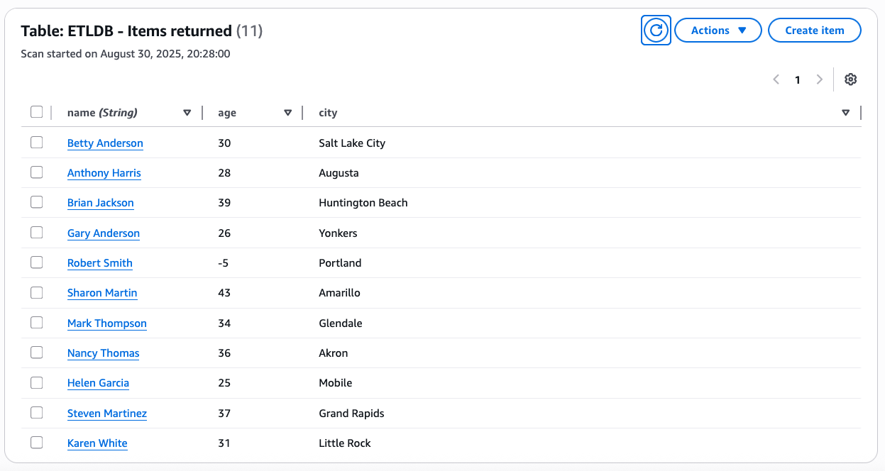

# Data Validation and ETL Pipeline

An AI-powered data validation and ETL (Extract, Transform, Load) pipeline that processes CSV records, validates them against a schema, and stores valid records in AWS DynamoDB.

## Features

- **AI-Powered Validation**: Uses Amazon Nova Lite LLM model via Strands framework for intelligent record validation
- **Schema Validation**: Validates records against predefined schema rules
- **AWS Integration**: Automatically stores valid records in DynamoDB
- **Batch Processing**: Processes the last 15 records from CSV files
- **Performance Metrics**: Tracks validation results and execution time

## Requirements

- Python 3.11 (recommended)
- AWS Account with DynamoDB access and Bedrock access for Nova Lite model
- Dependencies listed in `requirements.txt`

## Setup

1. **Create Virtual Environment**
   ```bash
   python3.11 -m venv venv
   source venv/bin/activate  # On Windows: venv\Scripts\activate
   ```

2. **Install Dependencies**
   ```bash
   pip install -r requirements.txt
   ```

2. **Configure AWS Credentials**
   
   Update the `.env` file with your AWS credentials:
   ```
   AWS_ACCESS_KEY_ID=your_access_key_id
   AWS_SECRET_ACCESS_KEY=your_secret_access_key
   AWS_SESSION_TOKEN=your_session_token
   AWS_DEFAULT_REGION=us-west-2
   ```

3. **Create DynamoDB Table**
   
   Create a DynamoDB table named `ETLDB` in the `us-west-2` region with:
   - Primary key: `name` (String)

## Data Schema

Records must contain the following fields:
- `name`: Non-empty string
- `age`: Integer value
- `city`: Non-empty string

See `schema.json` for the complete schema definition.

## Usage

Run the validation pipeline:

```bash
python validate_agent_clean.py
```

The program will:
1. Read the last 15 records from `test_data.csv`
2. Validate each record using AI-powered validation
3. Store valid records in the DynamoDB table
4. Output processing statistics in JSON format

## Output

The program returns a JSON response with:
- Total records inspected
- Count of valid/invalid records
- Number of records successfully written to database
- Execution time

Example output:
```json
{
  "statusCode": 200,
  "headers": {
    "Content-Type": "application/json"
  },
  "body": "{\"message\": \"Success\", \"data\": {\"records_inspected\": 15, \"valid_records\": 11, \"invalid_records\": 4, \"records_written\": 11, \"execution_time\": 65.56}}",
  "isBase64Encoded": false
}
```

## Sample DynamoDB Output



## File Structure

- `validate_agent_clean.py` - Main ETL pipeline script
- `test_data.csv` - Sample CSV data for processing
- `schema.json` - Data validation schema
- `.env` - AWS credentials configuration
- `README.md` - This documentation

## AWS Services Used

- **Amazon Bedrock**: Nova Lite model for AI-powered validation
- **Amazon DynamoDB**: Data storage for validated records

## Error Handling

The pipeline handles various validation scenarios:
- Empty or missing name fields
- Non-numeric age values
- Empty or missing city fields
- DynamoDB connection errors
